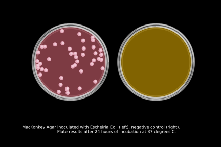

# Selective and Differential Media Simulator  

A project developed in BIOL 3770 Bioinformatics Projects Laboratory Spring Quarter 2022

  

Our Bacterial Selection Simulation code plates different strains of bacteria on differential and selective media in order to help the user identify which media can be used to isolate and identify bacterial strains. It takes a user input of bacterial strain and media combination and returns an output of two plates (one simulating the bacteria on the plate and the other a negative control plate). 
